# DSMS Server OOP Class Plan

## Goal
Build the server as a modular monolith using OOP and the Single Responsibility Principle (SRP).
Each module owns one bounded context and contains only the classes needed for that context.

## Core Rules
- One class = one reason to change.
- Controllers only handle HTTP input/output.
- Application services orchestrate use cases.
- Domain entities hold business rules and invariants.
- Repositories only deal with persistence.
- Policies/guards only decide access control.
- Shared utilities must stay in `src/shared`.

## Suggested Root Folder Layout
```text
src/
  app.ts
  server.ts
  config/
  shared/
    errors/
    logger/
    utils/
    contracts/
  modules/
    Auth/
    Tenant/
    User/
    Settings/
    Student/
    Instructor/
    Batch/
    Scheduling/
    Attendance/
    Exam/
    Payment/
    Payroll/
    Report/
    Notification/
    Lead/
    Expense/
    Audit/
    Progress/
    Super Admin/
```

## Cross-Cutting Base Classes

These are reusable classes that should live in `src/shared`.

| Class               | Folder                  | Responsibility                              |
| ------------------- | ----------------------- | ------------------------------------------- |
| `BaseEntity`        | `src/shared/domain/`    | Common entity identity and equality helpers |
| `DomainEvent`       | `src/shared/domain/`    | Common domain event contract                |
| `AppError`          | `src/shared/errors/`    | Base application error                      |
| `ValidationError`   | `src/shared/errors/`    | Input validation failure                    |
| `NotFoundError`     | `src/shared/errors/`    | Missing resource                            |
| `ForbiddenError`    | `src/shared/errors/`    | Access denied                               |
| `Logger`            | `src/shared/logger/`    | Central logging contract                    |
| `PaginationRequest` | `src/shared/contracts/` | Shared query pagination shape               |
| `PaginationResult`  | `src/shared/contracts/` | Shared paginated response shape             |

## Class Diagram Overview

```mermaid
classDiagram
  class BaseEntity
  class AppError
  class Logger

  class AuthController
  class AuthService
  class TokenService
  class AccessPolicy
  class PermissionGuard

  class TenantController
  class TenantService
  class TenantRepository

  class UserController
  class UserService
  class UserRepository

  class StudentController
  class StudentService
  class StudentRepository

  class InstructorController
  class InstructorService
  class InstructorRepository

  class BatchController
  class BatchService
  class BatchRepository

  class SchedulingController
  class SchedulingService
  class SchedulingRepository

  class AttendanceController
  class AttendanceService
  class AttendanceRepository

  class ExamController
  class ExamService
  class ExamRepository

  class PaymentController
  class PaymentService
  class PaymentRepository

  class PayrollController
  class PayrollService
  class PayrollRepository

  class ReportController
  class ReportService
  class ReportRepository

  class NotificationController
  class NotificationService
  class NotificationRepository

  class LeadController
  class LeadService
  class LeadRepository

  class ExpenseController
  class ExpenseService
  class ExpenseRepository

  class AuditController
  class AuditService
  class AuditRepository

  class ProgressController
  class ProgressService
  class ProgressRepository

  class SettingsController
  class SettingsService
  class SettingsRepository

  class SuperAdminController
  class SuperAdminService

  AuthController --> AuthService
  AuthService --> TokenService
  AuthService --> AccessPolicy
  AuthService --> PermissionGuard

  TenantController --> TenantService
  TenantService --> TenantRepository

  UserController --> UserService
  UserService --> UserRepository

  StudentController --> StudentService
  StudentService --> StudentRepository

  InstructorController --> InstructorService
  InstructorService --> InstructorRepository

  BatchController --> BatchService
  BatchService --> BatchRepository

  SchedulingController --> SchedulingService
  SchedulingService --> SchedulingRepository

  AttendanceController --> AttendanceService
  AttendanceService --> AttendanceRepository

  ExamController --> ExamService
  ExamService --> ExamRepository

  PaymentController --> PaymentService
  PaymentService --> PaymentRepository

  PayrollController --> PayrollService
  PayrollService --> PayrollRepository

  ReportController --> ReportService
  ReportService --> ReportRepository

  NotificationController --> NotificationService
  NotificationService --> NotificationRepository

  LeadController --> LeadService
  LeadService --> LeadRepository

  ExpenseController --> ExpenseService
  ExpenseService --> ExpenseRepository

  AuditController --> AuditService
  AuditService --> AuditRepository

  ProgressController --> ProgressService
  ProgressService --> ProgressRepository

  SettingsController --> SettingsService
  SettingsService --> SettingsRepository

  SuperAdminController --> SuperAdminService

  BaseEntity <|-- TenantService
  AppError <|-- ForbiddenError
```



## Folder and Class Plan by Module

### 1) Auth Module
**Folder:** `src/modules/Auth/`

**Purpose:** login, token issuing, guards, access control, session handling.

| Class             | Folder                        | Responsibility                                   |
| ----------------- | ----------------------------- | ------------------------------------------------ |
| `AuthController`  | `presentation/controllers/`   | HTTP login/logout/refresh endpoints              |
| `AuthService`     | `application/services/`       | Authenticate user, issue tokens, coordinate RBAC |
| `TokenService`    | `application/services/`       | Create and verify JWT/access tokens              |
| `SessionService`  | `application/services/`       | Manage active sessions and refresh tokens        |
| `PermissionGuard` | `application/guards/`         | Check permission before use case executes        |
| `RolePolicy`      | `application/policies/`       | Decide whether a role can perform an action      |
| `AuthRepository`  | `infrastructure/persistence/` | Load user credentials and session data           |

### 2) Tenant Module
**Folder:** `src/modules/Tenant/`

**Purpose:** tenant lifecycle, tenant boundaries, tenant settings.

| Class                   | Folder                        | Responsibility                |
| ----------------------- | ----------------------------- | ----------------------------- |
| `TenantController`      | `presentation/controllers/`   | Tenant CRUD endpoints         |
| `TenantService`         | `application/services/`       | Create/update/activate tenant |
| `TenantRepository`      | `infrastructure/persistence/` | Tenant persistence            |
| `TenantPolicy`          | `application/policies/`       | Tenant-level access rules     |
| `TenantSettingsService` | `application/services/`       | Tenant-specific config        |

### 3) User Module
**Folder:** `src/modules/User/`

**Purpose:** identities, profile, role assignment, account lifecycle.

| Class                   | Folder                        | Responsibility                   |
| ----------------------- | ----------------------------- | -------------------------------- |
| `UserController`        | `presentation/controllers/`   | User CRUD/profile endpoints      |
| `UserService`           | `application/services/`       | Create, update, deactivate users |
| `UserRepository`        | `infrastructure/persistence/` | User persistence                 |
| `RoleAssignmentService` | `application/services/`       | Assign roles to users            |
| `UserPolicy`            | `application/policies/`       | User visibility and edit rules   |

### 4) Settings Module
**Folder:** `src/modules/Settings/`

**Purpose:** system settings, tenant preferences, feature flags.

| Class                | Folder                        | Responsibility          |
| -------------------- | ----------------------------- | ----------------------- |
| `SettingsController` | `presentation/controllers/`   | Settings endpoints      |
| `SettingsService`    | `application/services/`       | Read/update settings    |
| `SettingsRepository` | `infrastructure/persistence/` | Settings persistence    |
| `FeatureFlagService` | `application/services/`       | Enable/disable features |

### 5) Student Module
**Folder:** `src/modules/Student/`

**Purpose:** student profile, enrollment, progress, self-service.

| Class               | Folder                        | Responsibility                |
| ------------------- | ----------------------------- | ----------------------------- |
| `StudentController` | `presentation/controllers/`   | Student endpoints             |
| `StudentService`    | `application/services/`       | Create/update/enroll students |
| `StudentRepository` | `infrastructure/persistence/` | Student persistence           |
| `StudentPolicy`     | `application/policies/`       | Student/self access rules     |
| `EnrollmentService` | `application/services/`       | Enrollment workflow           |

### 6) Instructor Module
**Folder:** `src/modules/Instructor/`

**Purpose:** instructor profile, assigned batches, teaching, attendance inputs.

| Class                       | Folder                        | Responsibility            |
| --------------------------- | ----------------------------- | ------------------------- |
| `InstructorController`      | `presentation/controllers/`   | Instructor endpoints      |
| `InstructorService`         | `application/services/`       | Create/update instructors |
| `InstructorRepository`      | `infrastructure/persistence/` | Instructor persistence    |
| `TeachingAssignmentService` | `application/services/`       | Assign classes/batches    |
| `InstructorPolicy`          | `application/policies/`       | Assigned-data access      |

### 7) Batch Module
**Folder:** `src/modules/Batch/`

**Purpose:** batches, class groups, batch lifecycle.

| Class             | Folder                        | Responsibility     |
| ----------------- | ----------------------------- | ------------------ |
| `BatchController` | `presentation/controllers/`   | Batch endpoints    |
| `BatchService`    | `application/services/`       | Batch lifecycle    |
| `BatchRepository` | `infrastructure/persistence/` | Batch persistence  |
| `BatchPolicy`     | `application/policies/`       | Batch access rules |

### 8) Scheduling Module
**Folder:** `src/modules/Scheduling/`

**Purpose:** schedules, class timetables, instructor allocations.

| Class                  | Folder                        | Responsibility               |
| ---------------------- | ----------------------------- | ---------------------------- |
| `SchedulingController` | `presentation/controllers/`   | Scheduling endpoints         |
| `SchedulingService`    | `application/services/`       | Create/adjust schedule       |
| `SchedulingRepository` | `infrastructure/persistence/` | Schedule persistence         |
| `SchedulePolicy`       | `application/policies/`       | Branch/tenant schedule rules |

### 9) Attendance Module
**Folder:** `src/modules/Attendance/`

**Purpose:** attendance capture, attendance approval, attendance reports.

| Class                  | Folder                        | Responsibility               |
| ---------------------- | ----------------------------- | ---------------------------- |
| `AttendanceController` | `presentation/controllers/`   | Attendance endpoints         |
| `AttendanceService`    | `application/services/`       | Mark/update attendance       |
| `AttendanceRepository` | `infrastructure/persistence/` | Attendance persistence       |
| `AttendancePolicy`     | `application/policies/`       | Who can mark/view attendance |

### 10) Exam Module
**Folder:** `src/modules/Exam/`

**Purpose:** tests, exam results, evaluations.

| Class            | Folder                        | Responsibility        |
| ---------------- | ----------------------------- | --------------------- |
| `ExamController` | `presentation/controllers/`   | Exam endpoints        |
| `ExamService`    | `application/services/`       | Manage exam lifecycle |
| `ExamRepository` | `infrastructure/persistence/` | Exam persistence      |
| `ResultService`  | `application/services/`       | Result processing     |

### 11) Payment Module
**Folder:** `src/modules/Payment/`

**Purpose:** fees, receipts, payment processing, refunds.

| Class               | Folder                        | Responsibility           |
| ------------------- | ----------------------------- | ------------------------ |
| `PaymentController` | `presentation/controllers/`   | Payment endpoints        |
| `PaymentService`    | `application/services/`       | Process payments/refunds |
| `PaymentRepository` | `infrastructure/persistence/` | Payment persistence      |
| `ReceiptService`    | `application/services/`       | Receipt generation       |

### 12) Payroll Module
**Folder:** `src/modules/Payroll/`

**Purpose:** salary, payroll runs, payslips.

| Class               | Folder                        | Responsibility      |
| ------------------- | ----------------------------- | ------------------- |
| `PayrollController` | `presentation/controllers/`   | Payroll endpoints   |
| `PayrollService`    | `application/services/`       | Payroll processing  |
| `PayrollRepository` | `infrastructure/persistence/` | Payroll persistence |
| `PayslipService`    | `application/services/`       | Payslip generation  |

### 13) Report Module
**Folder:** `src/modules/Report/`

**Purpose:** analytics, exports, dashboards, summaries.

| Class              | Folder                        | Responsibility      |
| ------------------ | ----------------------------- | ------------------- |
| `ReportController` | `presentation/controllers/`   | Report endpoints    |
| `ReportService`    | `application/services/`       | Build report data   |
| `ReportRepository` | `infrastructure/persistence/` | Read/report queries |
| `ExportService`    | `application/services/`       | PDF/CSV export      |

### 14) Notification Module
**Folder:** `src/modules/Notification/`

**Purpose:** in-app and external notifications.

| Class                    | Folder                        | Responsibility           |
| ------------------------ | ----------------------------- | ------------------------ |
| `NotificationController` | `presentation/controllers/`   | Notification endpoints   |
| `NotificationService`    | `application/services/`       | Send notifications       |
| `NotificationRepository` | `infrastructure/persistence/` | Notification persistence |
| `TemplateService`        | `application/services/`       | Notification templates   |

### 15) Lead Module
**Folder:** `src/modules/Lead/`

**Purpose:** enquiries, lead capture, conversion pipeline.

| Class            | Folder                        | Responsibility        |
| ---------------- | ----------------------------- | --------------------- |
| `LeadController` | `presentation/controllers/`   | Lead endpoints        |
| `LeadService`    | `application/services/`       | Lead lifecycle        |
| `LeadRepository` | `infrastructure/persistence/` | Lead persistence      |
| `LeadPolicy`     | `application/policies/`       | Lead visibility rules |

### 16) Expense Module
**Folder:** `src/modules/Expense/`

**Purpose:** operational expenses, approvals, tracking.

| Class                    | Folder                        | Responsibility      |
| ------------------------ | ----------------------------- | ------------------- |
| `ExpenseController`      | `presentation/controllers/`   | Expense endpoints   |
| `ExpenseService`         | `application/services/`       | Expense workflow    |
| `ExpenseRepository`      | `infrastructure/persistence/` | Expense persistence |
| `ExpenseApprovalService` | `application/services/`       | Approvals           |

### 17) Audit Module
**Folder:** `src/modules/Audit/`

**Purpose:** audit trail, access logging, change history.

| Class             | Folder                        | Responsibility                 |
| ----------------- | ----------------------------- | ------------------------------ |
| `AuditController` | `presentation/controllers/`   | Audit endpoints                |
| `AuditService`    | `application/services/`       | Record/query audit events      |
| `AuditRepository` | `infrastructure/persistence/` | Audit persistence              |
| `AuditLogger`     | `application/services/`       | Capture security/business logs |

### 18) Progress Module
**Folder:** `src/modules/Progress/`

**Purpose:** student progress, milestones, performance tracking.

| Class                | Folder                        | Responsibility               |
| -------------------- | ----------------------------- | ---------------------------- |
| `ProgressController` | `presentation/controllers/`   | Progress endpoints           |
| `ProgressService`    | `application/services/`       | Calculate and store progress |
| `ProgressRepository` | `infrastructure/persistence/` | Progress persistence         |
| `ProgressPolicy`     | `application/policies/`       | Who can view progress        |

### 19) Super Admin Module
**Folder:** `src/modules/Super Admin/`

**Purpose:** platform-wide administration, tenant oversight, system controls.

| Class                  | Folder                      | Responsibility              |
| ---------------------- | --------------------------- | --------------------------- |
| `SuperAdminController` | `presentation/controllers/` | Global admin endpoints      |
| `SuperAdminService`    | `application/services/`     | Cross-tenant administration |
| `PlatformPolicy`       | `application/policies/`     | Global access control       |

## Shared RBAC Classes

These classes should live in `src/modules/Auth/` or `src/shared/contracts/` depending on how reusable you want them.

| Class               | Suggested Folder                   | Responsibility                       |
| ------------------- | ---------------------------------- | ------------------------------------ |
| `Role`              | `src/modules/User/domain/`         | Role entity                          |
| `Permission`        | `src/modules/Auth/domain/`         | Permission entity                    |
| `RolePermission`    | `src/modules/Auth/domain/`         | Many-to-many role-permission mapping |
| `UserRole`          | `src/modules/User/domain/`         | Many-to-many user-role mapping       |
| `AccessContext`     | `src/modules/Auth/domain/`         | Tenant/branch/self scope context     |
| `PermissionCatalog` | `src/modules/Auth/application/`    | Central list of permission keys      |
| `RoleMatrixSeeder`  | `src/modules/Auth/infrastructure/` | Seed default role-permission mapping |

## RBAC Class Flow

1. `AuthController` receives login request.
2. `AuthService` authenticates the user.
3. `TokenService` issues token with role and scope claims.
4. `PermissionGuard` checks required permission before controller calls the service.
5. `Policy` classes decide whether the request is allowed at tenant/branch/own scope.
6. `Repository` classes only access the database.

## Ownership Rules
- Each module owns its own controller/service/repository classes.
- Cross-module access should happen through service interfaces, not direct repository calls.
- RBAC rules live in `Auth` and shared policies, not inside every module.
- `Tenant`, `User`, and `Auth` are core modules for every other module.

## Build Order Recommendation
1. Create shared error and contract classes.
2. Create `Auth`, `User`, and `Tenant` foundations.
3. Add RBAC catalog, role matrix, and guards.
4. Build business modules one by one.
5. Add tests for each module boundary.

## TDD Practice

This project should be developed using TDD.

### TDD Rules
- Write the test first.
- Keep production code minimal until the test passes.
- Refactor only after the test is green.
- Every new class should have a corresponding test.
- Test behavior, not implementation details.

### Test Folder Convention
All tests must live under the root `tests/` folder so CI can discover them.

Suggested test layout:
```text
tests/
  unit/
    modules/
      Auth/
      Tenant/
      User/
      Settings/
      Student/
      Instructor/
      Batch/
      Scheduling/
      Attendance/
      Exam/
      Payment/
      Payroll/
      Report/
      Notification/
      Lead/
      Expense/
      Audit/
      Progress/
      SuperAdmin/
    shared/
  integration/
    modules/
  e2e/
```

### Test Mapping Rule
- Place unit tests next to the module they verify, but under `tests/unit/modules/<ModuleName>/`.
- Place integration tests under `tests/integration/modules/<ModuleName>/`.
- Place end-to-end API tests under `tests/e2e/`.
- Do not place application tests inside `src/`.

### TDD Class-to-Test Example
- `src/modules/Auth/application/services/AuthService.ts`
  - test file: `tests/unit/modules/Auth/AuthService.spec.ts`
- `src/modules/User/application/services/UserService.ts`
  - test file: `tests/unit/modules/User/UserService.spec.ts`
- `src/modules/Attendance/application/services/AttendanceService.ts`
  - test file: `tests/unit/modules/Attendance/AttendanceService.spec.ts`

### CI Requirement
The CI pipeline must run tests from the root `tests/` folder only.
If a test is not under `tests/`, CI should not rely on it.

## RBAC: Remaining Classes & Tasks

Add the following classes, persistence, and workflows to complete RBAC integration across the app:

- **Persistence / DB**: `Role`, `RolePermission`, `UserRole` models in `prisma/schema.prisma` (or chosen ORM); migrations and index on tenant/branch scope.
- **Seeders**: `RoleMatrixSeeder` in `src/modules/Auth/infrastructure/` to seed default roles and role→permission mappings (tenant-aware).
- **Auth services**: `AuthService`, `TokenService`, `SessionService` in `src/modules/Auth/application/services/` (issue JWT with `roles`, `tenantId`, `branchId`, token-version; refresh-token rotation + revocation).
- **Repositories**: `AuthRepository` and `UserRepository` methods to load a user with roles and to resolve role→permission mappings (place in `infrastructure/persistence/`).
- **Middleware / Integration**: authentication middleware that validates token and attaches `AccessContext` (`userId`, `roles`, `tenantId`, `branchId`) to requests; a request-level permission middleware that uses `PermissionGuard`.
- **Policies**: per-module `*Policy` classes (tenant/branch/own checks) in `application/policies/` to evaluate scoped rules beyond role membership.
- **Admin APIs / UI**: endpoints to manage roles, permissions, and mappings with audit logging; tie into `Audit` module.
- **Caching & invalidation**: short-TTL cache for role→permission resolution and invalidation hooks on role/permission updates.
- **Auditing & monitoring**: record allow/deny decisions to `AuditRepository`; create alerts for unusual deny spikes.
- **Tests**: integration tests under `tests/integration/modules/Auth/` that create users, seed roles, issue tokens, and assert endpoint access/denies; unit tests for the new services/seeders/policies.
- **Docs**: update repository docs describing `PermissionCatalog` rules, how to add a permission, migration & rollout steps, and RBAC ownership.

Keep the in-memory `PermissionCatalog`, `RoleMatrix`, and `PermissionGuard` as the canonical definitions until seeders/migrations are in place; the seeder should derive DB records from the catalog to avoid drift.
