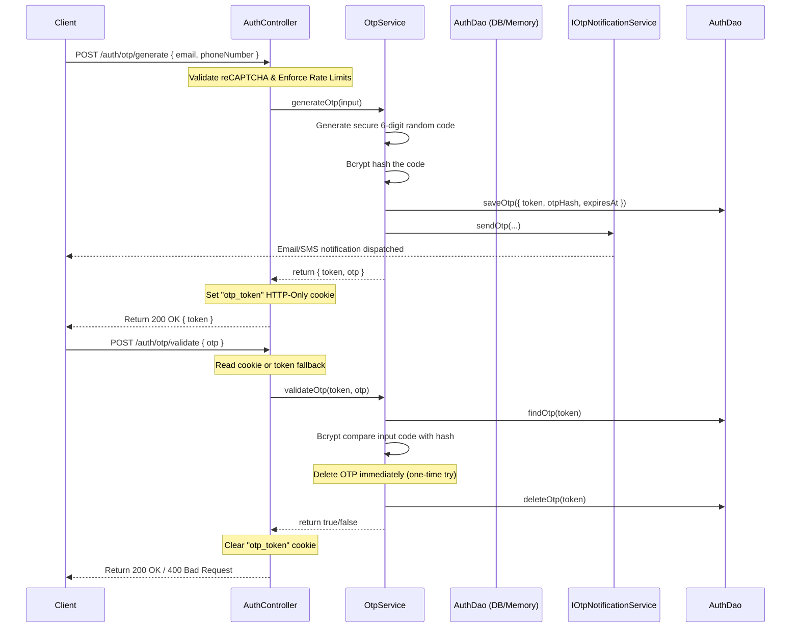

# OTP Generation and Validation Guide

This document describes the design, implementation, endpoints, and CLI testing flows for the DSMS One-Time Password (OTP) verification system.

---

## Architecture & Flow

The OTP module is decoupled from the notification module via an interface (`IOtpNotificationService`). This prevents the Auth module from depending directly on Twilio, Text.lk, or other providers.



### Key Security Decisions:
1. **One-Way Hashing**: OTP values are hashed using `bcrypt` before database storage. They are never saved in plaintext.
2. **Immediate Destruction on Attempt**: To prevent brute forcing, the OTP database record is deleted immediately on the first verification attempt, whether successful or failed. If validation fails, a new OTP must be generated.
3. **Hardened Rate Limiting**: The generation endpoint `/auth/otp/generate` is protected by a rate limiter of **5 requests per 10 minutes** per IP.
4. **reCAPTCHA Check**: Requires a valid Google reCAPTCHA token for generation, bypassable in local development by setting `DISABLE_CAPTCHA=true` in `.env`.

---

## HTTP API Endpoints

### 1. Generate OTP
* **URL**: `/auth/otp/generate`
* **Method**: `POST`
* **Body**:
  ```json
  {
    "email": "user@email.com",
    "phoneNumber": "+94771234567",
    "captchaToken": "g-recaptcha-response-token"
  }
  ```
  *(At least one recipient—email or phoneNumber—must be provided)*
* **Response**: Sets `otp_token` cookie and returns:
  ```json
  {
    "token": "d748f219-c09a-4c28-971a-68a865f375a0"
  }
  ```

### 2. Validate OTP
* **URL**: `/auth/otp/validate`
* **Method**: `POST`
* **Body**:
  ```json
  {
    "otp": "123456",
    "token": "d748f219-c09a-4c28-971a-68a865f375a0" 
  }
  ```
  *(The `token` body field is a fallback if cookies are blocked/unsupported)*
* **Response**: Clears `otp_token` cookie and returns:
  ```json
  {
    "message": "OTP validated successfully."
  }
  ```

---

## Local Testing with the CLI Script

We have provided a CLI testing script to automate testing the OTP flow locally.

### Prerequisites:
1. Server is running locally: `npm run dev`
2. Google reCAPTCHA is bypassed locally: `DISABLE_CAPTCHA=true` is set in your `.env`.

### Run the Script:
You can run the script and specify the recipient details as flags:
```bash
npx tsx src/scripts/test-otp.ts --email "user@email.com" --phone "+94771234567"
```
Or run it interactively:
```bash
npx tsx src/scripts/test-otp.ts
```

### Validation Failure / Regenerating Loop:
Because the database record is deleted immediately on verification attempts (successful or failed), **you cannot retry validation on the same OTP code**. If validation fails, the script will automatically generate a new OTP and prompt you to input the new one.
