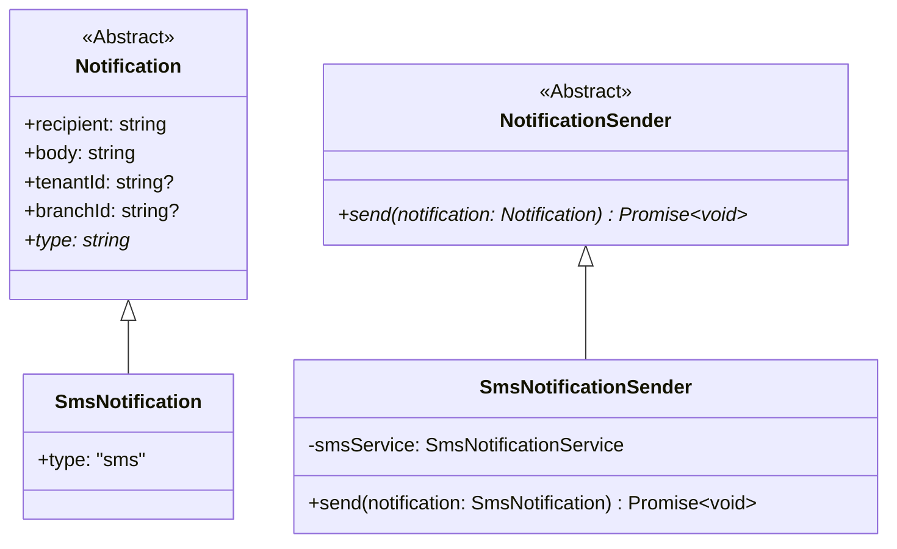

# Developer Guide: Notification Module

Welcome to the **Notification Module** documentation. This module handles external and internal notifications using a highly-decoupled, object-oriented design built on **SOLID principles**.

> [!IMPORTANT]
> **Exclusive In-App Access**: There are **no public HTTP API endpoints** exposed by the Notification module for triggering notifications. To send notifications, developers **must** use the module exclusively via **in-app object method calls** (e.g. calling `send` on the polymorphic `NotificationSender` instance).

Currently, the primary channel supported is **SMS** (using Twilio or a local Console mock for development). The system is fully extensible, enabling new channels (e.g., Email, Push, WhatsApp) to be added without breaking existing contracts.

---

## Architectural Principles

The module is designed around four main OOP components:

1. **`Notification` (Abstract Domain Model)**: Represents the base notification payload (e.g., recipient details, body content, and tenancy identifiers).
2. **`NotificationSender` (Abstract Service Model)**: Defines the common contract for sending any type of notification.
3. **`SmsNotification` & `SmsNotificationSender` (Concrete Implementations)**: Provide concrete logic for persisting and dispatching SMS notifications.
4. **`SmsProvider` (Infrastructure Strategy)**: An interface that abstracts away the specific gateway provider (e.g., Twilio), permitting alternative providers to be swapped easily.



---

## How to Send an SMS Notification

To send an SMS notification from other modules in the application, import and use the polymorphic `NotificationSender` abstraction:

```typescript
import { SmsNotification } from '../Notification/domain/SmsNotification.js';
import { SmsNotificationSender } from '../Notification/application/services/SmsNotificationSender.js';

class AccountService {
    public constructor(
        private readonly notificationSender: SmsNotificationSender
    ) {}

    public async inviteUser(phone: string, name: string): Promise<void> {
        // 1. Create your concrete Notification subclass
        const notification = new SmsNotification(
            phone,
            `Hi ${name}, you have been invited to join our Driving School Management System!`,
            'tenant-123',
            'branch-456'
        );

        // 2. Dispatch polymorphically using the sender
        await this.notificationSender.send(notification);
    }
}
```

---

## Extending with a New Notification Channel (e.g. Email)

Thanks to the **Open-Closed Principle**, you can add email notifications without modifying any SMS code.

### Step 1: Create the domain subclasses

Create `EmailNotification.ts`:
```typescript
import { Notification } from './Notification.js';

export class EmailNotification extends Notification {
    public override readonly type = 'email';
    
    public constructor(
        recipientEmail: string,
        body: string,
        public readonly subject: string,
        tenantId?: string,
        branchId?: string
    ) {
        super(recipientEmail, body, tenantId, branchId);
    }
}
```

### Step 2: Implement the sender

Create `EmailNotificationSender.ts`:
```typescript
import { NotificationSender } from '../../domain/NotificationSender.js';
import { EmailNotification } from '../../domain/EmailNotification.js';

export class EmailNotificationSender extends NotificationSender<EmailNotification> {
    public async send(notification: EmailNotification): Promise<void> {
        // Put your SMTP/SendGrid delivery logic here
        console.log(`Sending email to ${notification.recipient} with subject: ${notification.subject}`);
    }
}
```

---

## Local Development and Webhook Simulation

To prevent incurring Twilio API costs during local development, set the provider to console mock mode in your `.env` file:

```dotenv
SMS_PROVIDER_TYPE=console
SMS_CALLBACK_BASE_URL=http://localhost:3000
```

### The Console Mock Workflow

1. When `SMS_PROVIDER_TYPE` is `console`, the application initializes the `ConsoleSmsProvider`.
2. Outbound SMS messages are logged directly to the server terminal instead of dispatched over Twilio.
3. The provider simulates Twilio's asynchronous status callback behaviour by firing an actual HTTP POST request to the local webhook endpoint `POST /notifications/sms/callback` after `1 second`.
4. This ensures that the state transition loops (`PENDING` -> `SENT` -> `DELIVERED`) can be fully validated on your local machine without active API keys.
