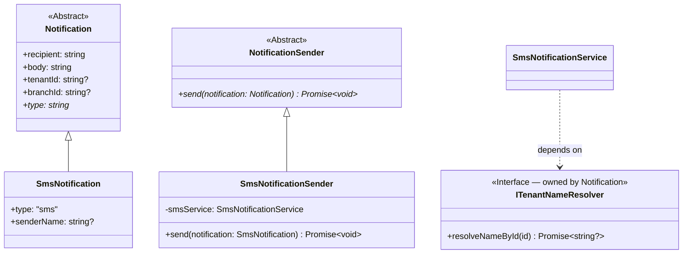

# Developer Guide: Notification Module

Welcome to the **Notification Module** documentation. This module handles external and internal notifications using a highly-decoupled, object-oriented design built on **SOLID principles**.

> [!IMPORTANT]
> **Exclusive In-App Access**: There are **no public HTTP API endpoints** exposed by the Notification module for triggering notifications. To send notifications, developers **must** use the module exclusively via **in-app object method calls** (e.g. calling `send` on the polymorphic `NotificationSender` instance).

Currently supported channels: **SMS** (Twilio, Text.lk, or Console mock) and **Email** (SendGrid or Console mock). The system is fully extensible — new channels (Push, WhatsApp, etc.) can be added without breaking existing contracts.

---

## Architectural Principles

The module is designed around four OOP components and follows the **Dependency Inversion Principle (DIP)** at every boundary:

1. **`Notification` (Abstract Domain Model)**: Base payload — recipient, body, tenant/branch context.
2. **`NotificationSender` (Abstract Service)**: Common contract for sending any notification type.
3. **`SmsNotification` & `SmsNotificationSender`**: Concrete SMS implementation.
4. **`SmsProvider` (Infrastructure Strategy)**: Abstracts the gateway (Twilio / Console mock).



---

## How to Send an SMS Notification

### Basic usage (no branding)

```typescript
import { SmsNotification } from '../Notification/domain/SmsNotification.js';
import { SmsNotificationSender } from '../Notification/application/services/SmsNotificationSender.js';

class AccountService {
    public constructor(
        private readonly smsSender: SmsNotificationSender
    ) {}

    public async notifyUser(phone: string, tenantId: string): Promise<void> {
        const notification = new SmsNotification(
            phone,                                    // recipient phone number (E.164 format)
            'Your account has been created.',         // message body
            tenantId,                                 // tenant context (for audit & sender lookup)
            'branch-456'                              // optional branch context
        );

        await this.smsSender.send(notification);
    }
}
```

### With tenant branding — recommended pattern

When you already know the tenant's display name (e.g. from the current auth context or a service call), pass it directly. **This is the preferred approach** — it avoids any extra DB lookup inside the Notification module:

```typescript
import { SmsNotification } from '../Notification/domain/SmsNotification.js';

// In your service, you already have the tenant name from context
const tenantName = 'TechSchool'; // fetched from TenantService or auth context

const notification = new SmsNotification(
    '+94771234567',              // recipient
    'Your OTP is 482910',        // body
    'tenant-abc',                // tenantId
    undefined,                   // branchId (optional)
    tenantName                   // ← senderName: recipient sees "TechSchool" as the From field
);

await smsSender.send(notification);
```

> [!NOTE]
> **Sender name rules (Twilio Alphanumeric Sender ID)**
> - Max **11 characters**. Special characters and spaces are automatically stripped.
> - **One-way only** — recipients cannot reply to an alphanumeric sender.
> - **Not available in all countries** — the US does not support it.
> - Check [Twilio country support](https://help.twilio.com/articles/223133767) before enabling.

### Without a senderName — automatic fallback chain

If you do **not** supply a `senderName`, the system resolves the sender automatically:

```
1. senderName on the message          ← you provided it (fastest, no DB hit)
2. ITenantNameResolver (DIP adapter)  ← looks up tenant name via TenantService
3. DEFAULT_SENDER_NAME env var        ← system-level fallback name
4. TWILIO_FROM_NUMBER                 ← phone number (final fallback)
```

So even without passing `senderName`, the recipient will still see the tenant's registered name — as long as the `tenantId` is valid.

---

## How to Send an Email Notification

```typescript
import { EmailNotification } from '../Notification/domain/EmailNotification.js';
import { EmailNotificationSender } from '../Notification/application/services/EmailNotificationSender.js';

class InvitationService {
    public constructor(
        private readonly emailSender: EmailNotificationSender
    ) {}

    public async sendWelcomeEmail(emailAddress: string, name: string, tenantId: string): Promise<void> {
        const email = new EmailNotification(
            emailAddress,
            `<h1>Welcome!</h1><p>Hi ${name}, your account is ready.</p>`,
            'Welcome to DSMS',
            tenantId,
            undefined
        );

        await this.emailSender.send(email);
    }
}
```

---

## Module Boundaries — what the Notification module does NOT do

> [!IMPORTANT]
> The Notification module **never imports** `TenantService`, `TenantDao`, or `prisma.tenant` directly.
> It depends only on the `ITenantNameResolver` interface it owns.

```
✅ Correct — Notification depends on its own interface:
   SmsNotificationService → ITenantNameResolver (interface, owned by Notification)

❌ Wrong — never do this inside the Notification module:
   import { TenantService } from '../../Tenant/...';
   prisma.tenant.findUnique(...)
```

The wiring happens **only in `app.ts`** (the composition root), where a thin adapter wraps `TenantService` and fulfils the `ITenantNameResolver` contract.

---

## Local Development and Webhook Simulation

Set your `.env` to use the Console mock — no Twilio API calls, no charges:

```dotenv
ENABLE_SMS=true
DEFAULT_SMS_SERVICE=console
EMAIL_PROVIDER_TYPE=console
SMS_CALLBACK_BASE_URL=http://localhost:3000
```

### How the Console mock works

1. `ConsoleSmsProvider` logs the outbound SMS to the terminal, showing `From`, `To`, and `Body`.
2. It fires a simulated Twilio status callback (`POST /notifications/sms/callback`) after 1 second.
3. This drives the full `PENDING → SENT → DELIVERED` state machine locally without real credentials.

---

## Testing Twilio Credentials (test script)

Use the built-in test script to verify your Twilio setup and the alphanumeric sender feature:

```bash
# Basic test — sends from TWILIO_FROM_NUMBER or TWILIO_ALPHA_SENDER (from .env)
npx tsx src/scripts/test-twilio.ts +94771234567

# Test with a specific tenant name as the sender
npx tsx src/scripts/test-twilio.ts +94771234567 "TechSchool"
```

The script prints which sender is active and confirms whether the alpha ID was used.

---

## Testing Text.lk Credentials (test script)

Use the built-in test script to verify your Text.lk Sri Lanka SMS Gateway setup:

```bash
# Basic test — sends from TEXT_LK_SENDER_ID (from .env)
npx tsx src/scripts/test-textlk.ts 94771234567

# Test with a specific tenant name as the sender
npx tsx src/scripts/test-textlk.ts 94771234567 "TechSchool"
```

---

## Environment Variables

| Variable | Required | Description |
|---|---|---|
| `ENABLE_SMS` | Optional | Toggles SMS functionality on or off (default `true`) |
| `DEFAULT_SMS_SERVICE` | ✅ | The active SMS provider type: `twilio`, `textlk`, or `console` |
| `TWILIO_ACCOUNT_SID` | When twilio | Twilio account SID |
| `TWILIO_AUTH_TOKEN` | When twilio | Twilio auth token |
| `TWILIO_FROM_NUMBER` | When twilio | Registered Twilio phone number (E.164) |
| `DEFAULT_SENDER_NAME` | Optional | System-level default sender name (max 11 chars, defaults to 'WEBBLAB') |
| `SMS_CALLBACK_BASE_URL` | ✅ | Base URL for Twilio status callbacks |
| `TEXT_LK_API_TOKEN` | When textlk | Text.lk Bearer API Token |
| `EMAIL_PROVIDER_TYPE` | ✅ | `sendgrid` or `console` |
| `SENDGRID_API_KEY` | When sendgrid | SendGrid API key |
| `SENDGRID_FROM_EMAIL` | When sendgrid | Verified sender email |
| `SENDGRID_FROM_NAME` | Optional | Display name for outbound emails |

